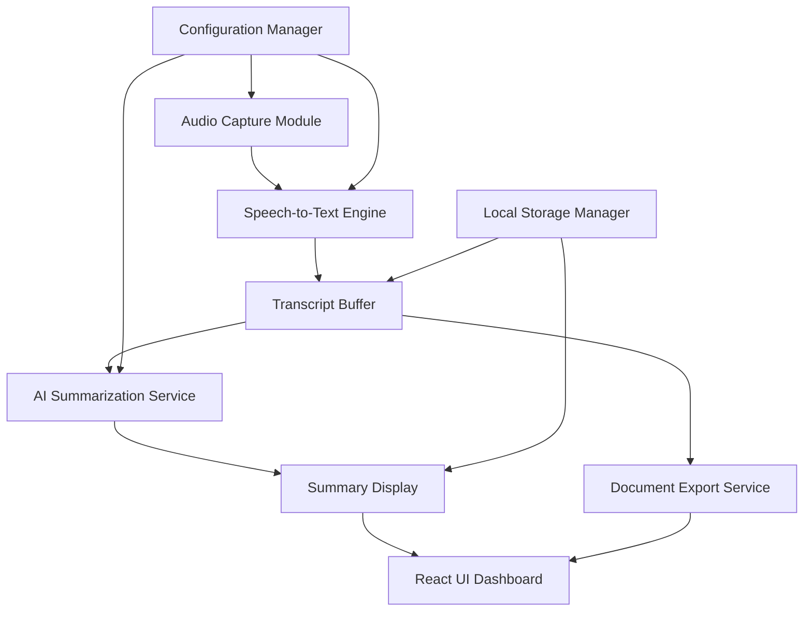

# Design Document

## Overview

The Real-Time Interview Summarizer is an Electron-based desktop application that provides automated meeting documentation through real-time audio capture, speech-to-text conversion, AI-powered summarization, and document export capabilities. The application prioritizes privacy through local processing while leveraging cloud AI services only for text summarization.

The system follows a modular architecture with clear separation between audio processing, transcription, AI summarization, and user interface components. All sensitive audio data remains local to the user's machine, with only processed text being sent to external AI services.

## Architecture

### System Architecture



### Technology Stack

**Frontend Framework:**
- Electron: Cross-platform desktop application framework
- React: UI component library with hooks for state management
- Material-UI (MUI): Component library for consistent UI design
- Tailwind CSS: Utility-first CSS for custom styling

**Audio Processing:**
- Web Audio API: Browser-native audio capture and processing
- MediaRecorder API: Record audio streams from system audio
- AudioContext: Real-time audio analysis and processing

**Speech-to-Text:**
- Web Speech API: Primary speech recognition engine (local processing)
- Google Cloud Speech-to-Text: Fallback option for enhanced accuracy
- Mozilla DeepSpeech: Offline alternative for privacy-focused users

**AI Integration:**
- Google Gemini API: Text summarization and analysis
- Custom prompt engineering for meeting-specific summarization

**Document Generation:**
- jsPDF: Client-side PDF generation
- docx: JavaScript library for DOCX file creation
- html2canvas: Convert HTML content to images for PDF embedding

**Data Storage:**
- IndexedDB: Browser-based persistent storage for transcripts and summaries
- localStorage: Configuration and session state management
- File System Access API: Direct file saving capabilities

### Application Structure

```
src/
├── main/                    # Electron main process
│   ├── main.js             # Application entry point
│   ├── audio-capture.js    # System audio capture logic
│   └── file-operations.js  # File system operations
├── renderer/               # Electron renderer process
│   ├── components/         # React components
│   │   ├── Dashboard.jsx   # Main application interface
│   │   ├── AudioControls.jsx # Recording controls
│   │   ├── TranscriptView.jsx # Live transcription display
│   │   ├── SummaryPanel.jsx # AI summary display
│   │   └── ExportDialog.jsx # Document export interface
│   ├── services/           # Business logic services
│   │   ├── speechService.js # Speech-to-text processing
│   │   ├── aiService.js    # Gemini API integration
│   │   ├── exportService.js # Document generation
│   │   └── storageService.js # Data persistence
│   ├── hooks/              # Custom React hooks
│   │   ├── useAudioCapture.js # Audio capture state management
│   │   ├── useTranscription.js # Transcription state management
│   │   └── useSummary.js   # Summary state management
│   └── utils/              # Utility functions
│       ├── audioUtils.js   # Audio processing utilities
│       ├── textUtils.js    # Text processing utilities
│       └── apiUtils.js     # API communication utilities
└── assets/                 # Static assets
    ├── icons/              # Application icons
    └── templates/          # Export templates
```

## Components and Interfaces

### Audio Capture Module

**Purpose:** Captures system audio from meeting applications in real-time.

**Key Methods:**
- `startCapture()`: Initialize audio capture from system audio
- `pauseCapture()`: Temporarily pause audio recording
- `stopCapture()`: Finalize and process captured audio
- `getAudioLevel()`: Monitor audio input levels for UI indicators

**Configuration:**
- Sample rate: 44.1kHz for high-quality capture
- Buffer size: 4096 samples for low-latency processing
- Audio format: PCM 16-bit for compatibility

**Error Handling:**
- Graceful degradation when audio permissions are denied
- Automatic retry logic for temporary audio device issues
- User notifications for audio configuration problems

### Speech-to-Text Engine

**Purpose:** Convert captured audio to text with timestamp information.

**Primary Implementation (Web Speech API):**
```javascript
interface SpeechRecognitionConfig {
  continuous: boolean;
  interimResults: boolean;
  language: string;
  maxAlternatives: number;
}

interface TranscriptSegment {
  text: string;
  timestamp: number;
  confidence: number;
  isFinal: boolean;
}
```

**Key Features:**
- Real-time transcription with <2 second latency
- Confidence scoring for transcription quality
- Automatic punctuation and capitalization
- Timestamp tracking for each text segment

**Fallback Strategy:**
1. Web Speech API (primary, local processing)
2. Google Cloud Speech-to-Text (enhanced accuracy)
3. Mozilla DeepSpeech (offline capability)

### AI Summarization Service

**Purpose:** Generate intelligent summaries using Google Gemini API.

**Prompt Engineering:**
```javascript
const SUMMARIZATION_PROMPT = `
Role: You are an expert meeting summarizer and note-taker.
Task: Analyze this meeting transcript and create a structured summary.
Context: This is a real-time transcript from an online meeting.

Requirements:
1. Create a concise summary (150-200 words)
2. Identify key discussion points and decisions
3. Extract action items and next steps
4. Note important quotes or insights
5. Organize by topics/themes discussed

Format:
## Meeting Summary
**Date:** [timestamp]
**Duration:** [calculated]

### Key Discussion Points
- [Point 1]
- [Point 2]

### Decisions Made
- [Decision 1]
- [Decision 2]

### Action Items
- [Action 1]
- [Action 2]

### Important Quotes
- "[Quote]"

Transcript to analyze: [TRANSCRIPT_TEXT]
`;
```

**API Integration:**
- Rate limiting: 15 requests/minute (Gemini free tier)
- Token management: 1M tokens/month limit
- Request queuing for rate limit compliance
- Error handling for API failures

**Processing Strategy:**
- Chunk processing: 30-second transcript segments
- Incremental summarization for real-time updates
- Context preservation across chunks

### Document Export Service

**Purpose:** Generate structured documents in multiple formats.

**Supported Formats:**
- PDF: Using jsPDF with custom templates
- DOCX: Using docx library with structured formatting
- TXT: Plain text with organized sections

**Export Template Structure:**
```javascript
interface ExportTemplate {
  header: {
    title: string;
    date: string;
    duration: string;
  };
  sections: {
    summary: string;
    keyPoints: string[];
    decisions: string[];
    actionItems: string[];
    quotes: string[];
  };
  footer: {
    generatedBy: string;
    timestamp: string;
  };
}
```

**Customization Options:**
- Template selection (formal, casual, detailed)
- Section inclusion/exclusion
- Formatting preferences (fonts, colors, layout)

### Local Storage Manager

**Purpose:** Manage persistent data storage and retrieval.

**Data Schema:**
```javascript
interface MeetingSession {
  id: string;
  date: string;
  duration: number;
  transcript: TranscriptSegment[];
  summary: string;
  metadata: {
    platform: string;
    audioQuality: number;
    processingTime: number;
  };
}
```

**Storage Strategy:**
- IndexedDB for large transcript data
- localStorage for configuration and preferences
- Automatic cleanup of old sessions (user-configurable retention)
- Data compression for efficient storage

## Data Models

### Core Data Structures

**AudioStream:**
```javascript
interface AudioStream {
  id: string;
  source: MediaStream;
  sampleRate: number;
  channels: number;
  bufferSize: number;
  isActive: boolean;
}
```

**TranscriptSegment:**
```javascript
interface TranscriptSegment {
  id: string;
  text: string;
  timestamp: number;
  confidence: number;
  isFinal: boolean;
  duration: number;
}
```

**Summary:**
```javascript
interface Summary {
  id: string;
  sessionId: string;
  content: string;
  keyPoints: string[];
  decisions: string[];
  actionItems: string[];
  quotes: string[];
  generatedAt: number;
  processingTime: number;
}
```

**ExportDocument:**
```javascript
interface ExportDocument {
  id: string;
  sessionId: string;
  format: 'pdf' | 'docx' | 'txt';
  template: string;
  content: Uint8Array;
  filename: string;
  createdAt: number;
}
```

### State Management

**Application State:**
```javascript
interface AppState {
  recording: {
    isActive: boolean;
    isPaused: boolean;
    duration: number;
    audioLevel: number;
  };
  transcription: {
    segments: TranscriptSegment[];
    currentText: string;
    confidence: number;
    isProcessing: boolean;
  };
  summary: {
    current: Summary | null;
    isGenerating: boolean;
    lastUpdated: number;
  };
  ui: {
    activeTab: string;
    theme: 'light' | 'dark';
    notifications: Notification[];
  };
}
```

## Error Handling

### Audio Capture Errors

**Permission Denied:**
- Display clear instructions for enabling microphone access
- Provide alternative setup guides for different operating systems
- Graceful fallback to manual transcript input

**Device Not Available:**
- Automatic device detection and selection
- User-friendly device configuration interface
- Retry mechanisms for temporary device issues

**Audio Quality Issues:**
- Real-time audio level monitoring
- Automatic gain control and noise reduction
- User notifications for poor audio conditions

### Speech Recognition Errors

**API Failures:**
- Automatic fallback to alternative speech engines
- Local caching of partial transcripts
- User notifications with recovery options

**Low Confidence Transcription:**
- Visual confidence indicators in the UI
- Option to manually correct transcription
- Highlighting of uncertain text segments

### AI Service Errors

**Rate Limiting:**
- Request queuing with user-visible progress
- Intelligent batching of summarization requests
- Graceful degradation to basic text processing

**API Unavailability:**
- Local caching of previous summaries
- Offline mode with basic text analysis
- Clear user communication about service status

### Data Storage Errors

**Storage Quota Exceeded:**
- Automatic cleanup of old sessions
- User-configurable retention policies
- Data compression and optimization

**Corruption Recovery:**
- Data validation and integrity checks
- Automatic backup and recovery mechanisms
- User options for data export and migration

## Testing Strategy

### Unit Testing

**Audio Processing:**
- Mock audio streams for consistent testing
- Test audio capture initialization and cleanup
- Validate audio level detection and monitoring

**Speech Recognition:**
- Mock speech recognition APIs
- Test confidence scoring and error handling
- Validate transcript segmentation and timing

**AI Summarization:**
- Mock Gemini API responses
- Test prompt engineering and response parsing
- Validate rate limiting and error recovery

**Document Export:**
- Test PDF, DOCX, and TXT generation
- Validate template rendering and formatting
- Test file system operations and permissions

### Integration Testing

**End-to-End Workflows:**
- Complete recording to export workflow
- Multi-platform compatibility testing
- Performance testing with long meetings

**API Integration:**
- Real API testing with rate limiting
- Error scenario testing (network failures, API errors)
- Authentication and authorization testing

### Performance Testing

**Memory Usage:**
- Monitor memory consumption during long recordings
- Test garbage collection and memory cleanup
- Validate storage efficiency and compression

**Processing Latency:**
- Measure speech-to-text conversion speed
- Test AI summarization response times
- Validate real-time UI update performance

**Resource Utilization:**
- CPU usage monitoring during processing
- Network bandwidth usage for API calls
- Disk I/O performance for storage operations

### User Acceptance Testing

**Usability Testing:**
- Interface intuitiveness and ease of use
- Accessibility compliance (keyboard navigation, screen readers)
- Cross-platform consistency testing

**Reliability Testing:**
- Long-duration recording stability
- Recovery from system sleep/wake cycles
- Handling of system resource constraints

**Security Testing:**
- Data privacy and local storage security
- API communication security (HTTPS, authentication)
- File system access permissions and sandboxing